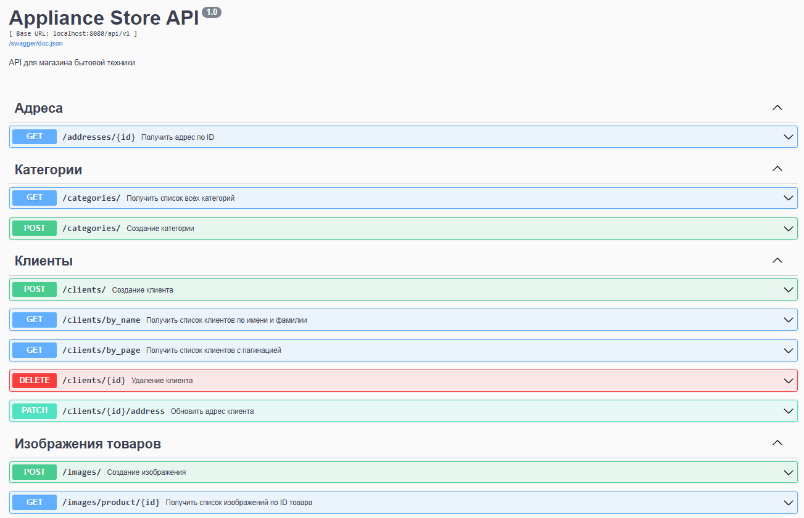
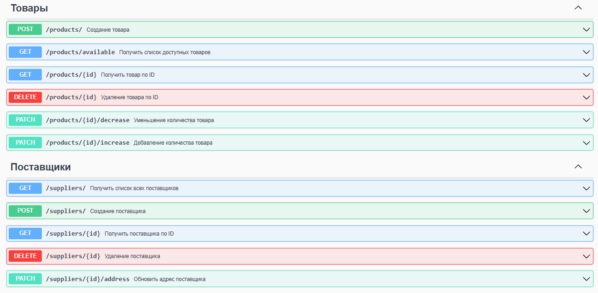

## Реализованы популярные виды HTTP-запросов (GET, POST, DELETE, PATCH). Хранение данных реализовано в PostgreSQL.

### Для клиентов:

- Добавление клиента;

- Удаление клиента;

- Получение клиентов по имени и фамилии;

- Получение всех клиентов (опциональные параметры пагинации: limit и offset. В случае отсутствия этих параметров возвращается весь список);

- Изменение адреса клиента.

### Для товаров:

- Добавление товара;

- Уменьшение количества товара;

- Получение товара по id;

- Получение всех доступных товаров;

- Удаление товара по id.

### Для поставщиков:

- Добавление поставщика;

- Изменение адреса поставщика;

- Удаление поставщика по id;

- Получение всех поставщиков;

- Получение поставщика по id.

### Для изображений:

- добавление изображения;

- Изменение изображения;

- Удаление изображения по id изображения;

- Получение изображения конкретного товара;

- Получение изображения по id изображения.
